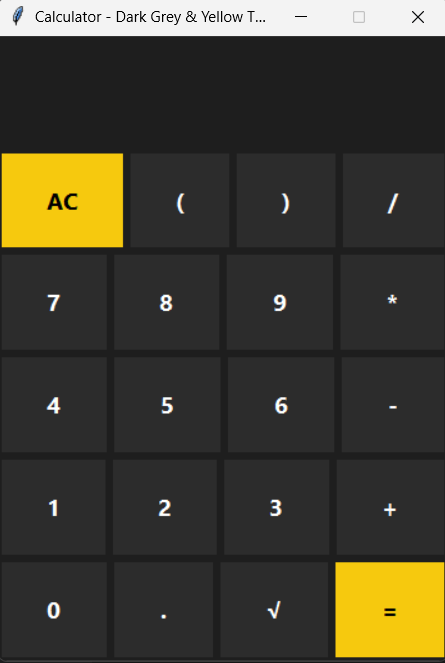
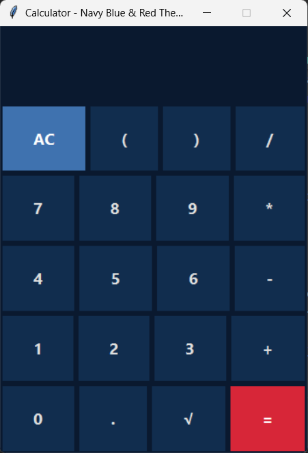
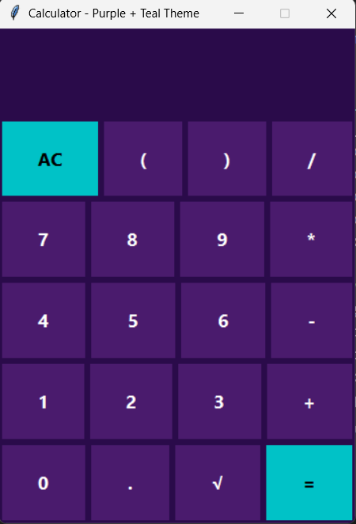
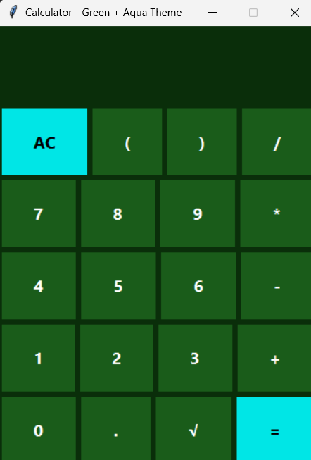

<div align="center">
  <h1>🧮 Smart Tkinter Calculator</h1>
  <p>Beautiful, responsive calculator with multiple themes built with Python Tkinter</p>
  
  <p>
    
    
    
  </p>
  
  
  
  
  
</div>

---

## 🎨 Calculator Themes

### Theme 1: Dark Grey & Yellow

- **Colors**: Dark grey background with yellow accents
- **File**: `calc_theme1.py`

### Theme 2: Blue & White

- **Colors**: Blue background with white accents
- **File**: `calc_theme2.py`

### Theme 3: Purple & Teal

- **Colors**: Dark purple background with teal accents
- **File**: `calc_theme3.py`

### Theme 4: Green & Aqua

- **Colors**: Dark green background with aqua accents
- **File**: `calc_theme4.py`

---

## ✨ Features

### 🎯 Core Functionality
- 🧮 Basic arithmetic operations (+, -, ×, ÷)
- 🔢 Scientific functions (√, parentheses)
- ⌨️ Full keyboard support
- 🖱️ Responsive button hover effects

### ⚡ Performance
- ⚡ Fast and lightweight
- 💾 Minimal memory usage
- 🚫 No external dependencies

---

## 🚀 Getting Started

### Prerequisites
- Python 3.8 or higher
- Tkinter (usually comes with Python)

### Installation
1. Clone the repository
```bash
git clone https://github.com/your-username/smart-tkinter-calculator.git
cd smart-tkinter-calculator
```

2. Run any theme:
```bash
python calc_theme1.py  # Dark Grey & Yellow
exit
python calc_theme2.py  # Blue & White
exit
python calc_theme3.py  # Purple & Teal
exit
python calc_theme4.py  # Green & Aqua
```

---

## 🎮 Usage

### Basic Operations
- Click buttons or use your keyboard to input numbers and operators
- Press `Enter` or click `=` to calculate
- Press `AC` to clear input
- Use `√` for square root
- Use `(` and `)` for complex expressions

### Keyboard Shortcuts
- `0-9`, `+`, `-`, `*`, `/` - Basic operations
- `Enter` - Calculate result
- `Backspace` - Delete last character
- `C` - Clear input
- `s` - Square root (√)

---

## 🛠️ Project Structure

```
smart-tkinter-calculator/
├── calc_theme1.py    # Dark Grey & Yellow theme
├── calc_theme2.py    # Blue & White theme
├── calc_theme3.py    # Purple & Teal theme
├── calc_theme4.py    # Green & Aqua theme
├── screenshots-pro/  # Theme screenshots
│   ├── theme1.png
│   ├── theme2.png
│   ├── theme3.png
│   └── theme4.png
└── README.md         # This documentation
```

---

## 🤝 Contributing

Contributions are welcome! Please feel free to submit a Pull Request.

1. Fork the Project
2. Create your Feature Branch (`git checkout -b feature/NewTheme`)
3. Commit your Changes (`git commit -m 'Add new theme'`)
4. Push to the Branch (`git push origin feature/NewTheme`)
5. Open a Pull Request

---

## 📜 License

Distributed under the MIT License. See `LICENSE` for more information.

---

<p align="center">
  Made with ❤️ by Your Name
</p>
